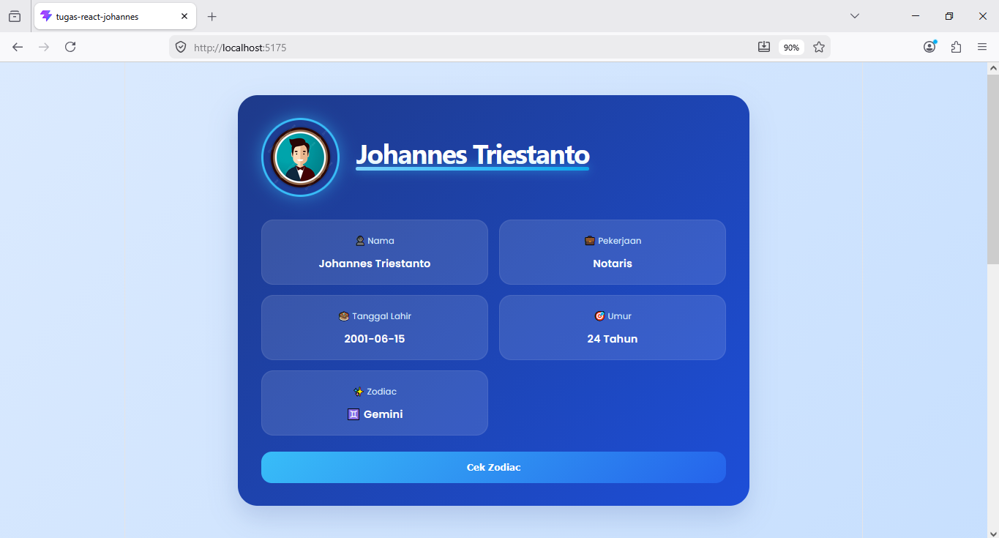
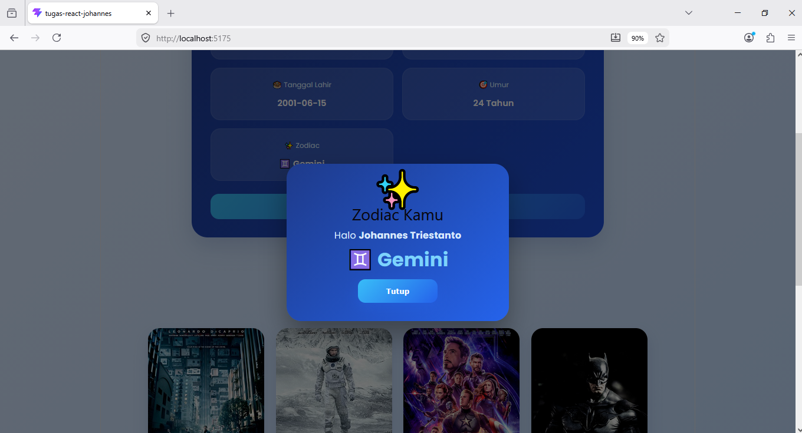
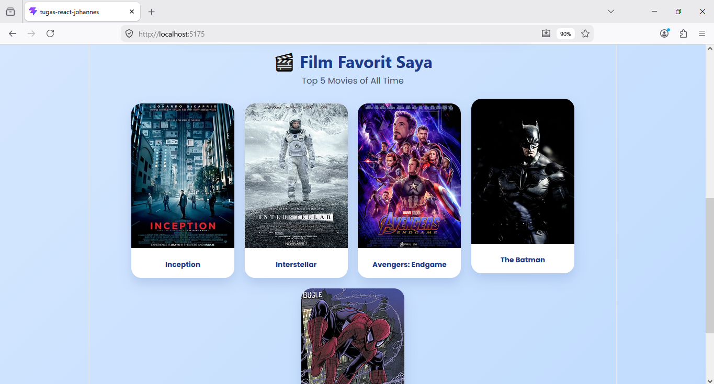

# Tugas React Johannes

Project ini merupakan aplikasi sederhana berbasis **React JS** yang menampilkan informasi profil pengguna serta daftar film favorit dengan tampilan modern bertema biru muda dan biru tua.

## Fitur Utama

* Menampilkan profil pengguna
* Menghitung umur secara otomatis berdasarkan tanggal lahir
* Menampilkan zodiac berdasarkan tanggal lahir
* Popup zodiac dengan desain modern
* Daftar film favorit dalam bentuk card
* Responsive untuk desktop dan mobile
* UI modern dengan kombinasi warna biru muda dan biru tua

---

## Teknologi yang Digunakan

* React JS
* Vite
* JavaScript
* CSS3

---

## Screenshot

### Halaman Profil



---

### Popup Zodiac



---

### Film Favorit



---

## Cara Menjalankan Project

Clone repository:

```bash
git clone https://github.com/JohannesTriestanto/tugas-react-johannes.git
```

Masuk ke folder project:

```bash
cd tugas-react-johannes
```

Install dependency:

```bash
npm install
```

Jalankan project:

```bash
npm run dev
```

---

## Author

**Johannes Triestanto**

Tugas React JS
